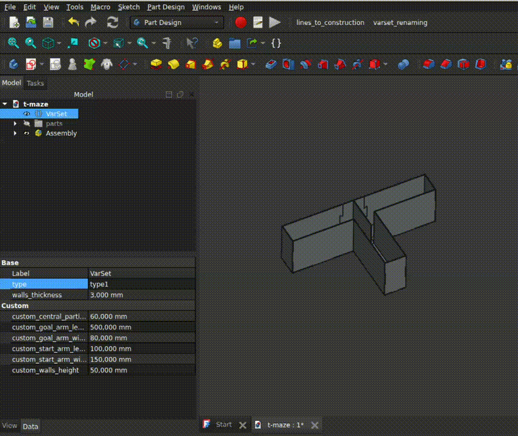
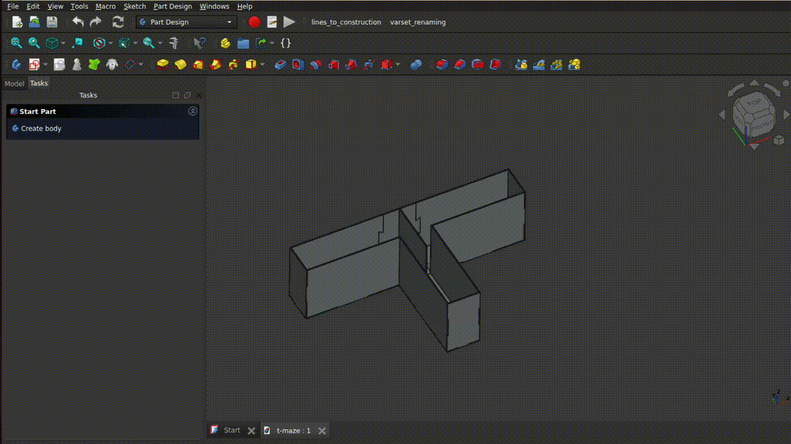

# Simple parametric T-maze
This is a simple and parametric T-maze designed with FreeCAD, for laser cutting.  
The design is based on the following article: **Robert M J Deacon & J Nicholas P Rawlins** (2006). *T-maze alternation in the rodent*.  



# Want to laser cut the maze ? 
The following files are already available:
- Mouse
    - 4 mm thick walls

> [!NOTE]  
> If you want to use another material thickness, please refer to the next section. 
> If you export new files with other thicknesses or dimensions, feel free to let me know so I can upload them (or do a PR) 

1. Select your favorite format ([dxf](dxf/), [stl](stl/), [step](step/))
2. Select the type of maze you want (mouse, rat)
3. Laser cut the following parts :
    - central_partition (x1)
    - central_tile (x1)
    - central_wall (x1)
    - goal_arm_wall_long1 (x2)
    - goal_arm_wall_long2 (X2)
    - goal_arm_wall_small (x2)
    - goal_floor (x2)
    - start_arm_long (X2)
    - start_arm_wall_small (x1)
    - start_floor (x1)

# Want to play with parametric CAD files ?
## Generate the maze 
1. Download FreeCAD V1.0 or later
2. In FreeCAD, open t-maze.FCStd ([located in cad/t-maze.FCStd](cad/t-maze.FCStd))
3. On the Model tab, click VarSet then select a type of maze
4. Refresh the project
5. Change the value of the walls thickness if needed

## Export the files
You can use an external FreeCAD workbench to easily export the files in 2D, called LCInterlocking.
### Install LCInterlocking
1. In FreeCAD > Tools > Addon Manager
2. In the search bar, search for LCInterlocking > Install
3. Restart FreeCAD, and re-open the t-maze project 

### Export the files
1. Open the Laser Cut Interlocking workbench
2. Select all parts you want to export (inside the Assembly folder on the Model tab)
3. Click the "Export" function of this workbench. This opens a new project with only 2D shapes
4. Select only the files starting with *Shape2DView", and delete the others
5. Click on each file individually, the export them with File > Export, and select Autodesk DXF 2D. Make sure you file ends with *.dxf*.



## For custom values
1. Select VarSet > type > custom
2. Change the the values of the parameters starting with *custom_*

# More information about the project
With this project I tried to experiment with some freeCAD features:
- The new native Assembly workbench from FreeCAD v1.0
- VarSet: 
    - I tried to create a drop-down list in a variable, and this is possible selecting App::PropertyEnumeration 
    - I also tried to use IF statements in variables: if you want to look closer at the VarSet object, you can see hidden variables with IF statments. And it looks like this:
        - ```type == 0 ? type1_walls_height : (type == 1 ? type2_walls_height : custom_walls_height)```
        - Note that I could not use strings, so I used the list item number

